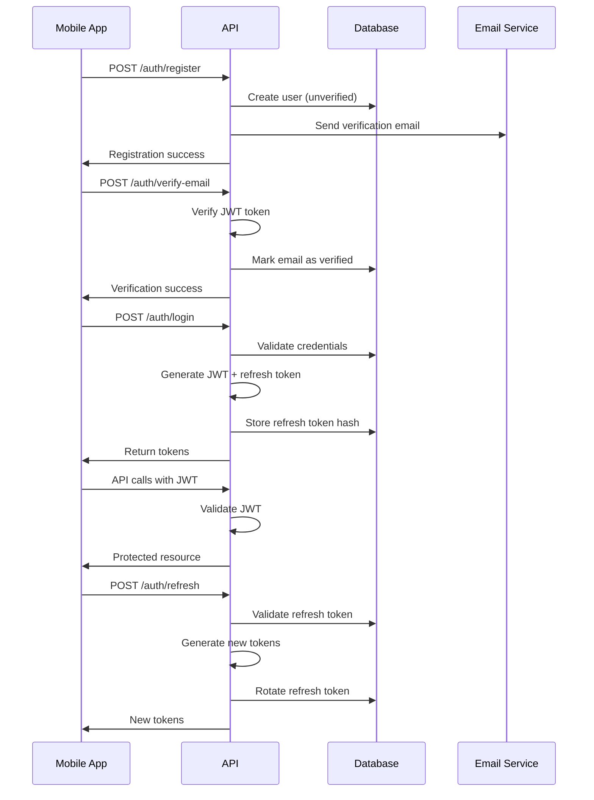

# Aussie Markets - Architecture Documentation

## Table of Contents

1. [System Overview](#system-overview)
2. [Epoch 1 - Foundation](#epoch-1---foundation)
3. [Epoch 2 - Authentication](#epoch-2---authentication)
4. [Technology Stack](#technology-stack)
5. [Security Architecture](#security-architecture)
6. [Data Flow](#data-flow)
7. [Deployment Architecture](#deployment-architecture)

## System Overview

Aussie Markets is a regulated prediction market platform for Australian users, built as a modern, scalable system with strong security foundations. The platform enables real-money wagering in Australian Dollars (AUD) with comprehensive KYC/AML compliance.

### High-Level Architecture

```
┌─────────────────┐    ┌─────────────────┐    ┌─────────────────┐
│   Mobile App    │    │   Web App       │    │   Admin Panel   │
│  (React Native) │    │   (Future)      │    │   (Future)      │
└─────────┬───────┘    └─────────┬───────┘    └─────────┬───────┘
          │                      │                      │
          └──────────────────────┼──────────────────────┘
                                 │
                    ┌─────────────▼───────────────┐
                    │        API Gateway          │
                    │     (NestJS + Express)      │
                    └─────────────┬───────────────┘
                                  │
                    ┌─────────────▼───────────────┐
                    │     Business Logic Layer     │
                    │  Auth │ Markets │ Trading   │ 
                    │  KYC  │ Wallet  │ Admin     │
                    └─────────────┬───────────────┘
                                  │
                    ┌─────────────▼───────────────┐
                    │      Data Layer             │
                    │ PostgreSQL │ Redis │ S3    │
                    └─────────────────────────────┘
```

## Epoch 1 - Foundation

**Goal**: Establish monorepo structure, CI/CD pipelines, and infrastructure foundation.

### Monorepo Structure

```
aussie-markets/
├── apps/                    # Applications
│   ├── api/                # NestJS backend API
│   ├── mobile/             # Expo React Native app
│   └── web/                # Future web interface
├── packages/               # Shared libraries (future)
├── ops/                    # Operations & infrastructure
│   ├── secrets.md          # Secrets management plan
│   └── cloud-infrastructure.md  # AWS infrastructure specs
├── docs/                   # Documentation
├── .github/workflows/      # CI/CD pipelines
├── package.json           # Root workspace configuration
└── pnpm-workspace.yaml    # pnpm workspace definition
```

### Key Achievements

1. **Package Management**: pnpm workspaces with optimized dependency management
2. **Code Quality**: ESLint + Prettier with strict TypeScript configuration
3. **CI/CD Pipelines**: Automated testing, linting, security scanning, and deployment
4. **Infrastructure Planning**: Complete AWS ap-southeast-2 staging environment design
5. **Secret Management**: Secure local development and production deployment strategy

### Technology Decisions

| Component | Technology | Rationale |
|-----------|------------|-----------|
| Package Manager | pnpm | Fast, efficient, strict dependency resolution |
| Monorepo | pnpm workspaces | Simplified dependency management, shared tooling |
| Linting | ESLint + Prettier | Code consistency, automated formatting |
| CI/CD | GitHub Actions | Native GitHub integration, flexible workflows |
| Cloud | AWS ap-southeast-2 | Australian data residency, comprehensive services |

## Epoch 2 - Authentication

**Goal**: Implement secure email/password authentication with JWT tokens and email verification.

### Authentication Flow



### Security Implementation

#### Password Security
- **Algorithm**: Argon2id (OWASP recommended)
- **Memory Cost**: 64MB minimum (65,536 KiB)
- **Time Cost**: 3 iterations minimum
- **Parallelism**: 1 thread
- **Hash Length**: 32 bytes

#### Token Security
- **Access Tokens**: JWT, 15-minute expiry, minimal claims
- **Refresh Tokens**: 256-bit random, opaque, hashed storage
- **Token Rotation**: New refresh token on each use
- **Storage**: Mobile Keychain only (never AsyncStorage)

#### Email Verification
- **Algorithm**: JWS (JSON Web Signature)
- **Expiry**: 24 hours
- **Claims**: userId, email, purpose, issuer, audience
- **Delivery**: Console logging (dev), email service (prod)

### Database Schema

#### Users Table
```sql
CREATE TABLE users (
    id UUID PRIMARY KEY DEFAULT gen_random_uuid(),
    email VARCHAR UNIQUE NOT NULL,
    password_hash VARCHAR NOT NULL,
    role user_role DEFAULT 'user',
    email_verified BOOLEAN DEFAULT false,
    email_verified_at TIMESTAMP,
    mfa_enabled BOOLEAN DEFAULT false,
    first_name VARCHAR,
    last_name VARCHAR,
    phone_number VARCHAR,
    is_active BOOLEAN DEFAULT true,
    last_login_at TIMESTAMP,
    last_login_ip VARCHAR,
    created_at TIMESTAMP DEFAULT NOW(),
    updated_at TIMESTAMP DEFAULT NOW()
);
```

#### Refresh Tokens Table
```sql
CREATE TABLE refresh_tokens (
    id UUID PRIMARY KEY DEFAULT gen_random_uuid(),
    token_hash VARCHAR NOT NULL,
    user_id UUID REFERENCES users(id) ON DELETE CASCADE,
    expires_at TIMESTAMP NOT NULL,
    revoked_at TIMESTAMP,
    revoked_by_ip VARCHAR,
    replaced_by_token VARCHAR,
    created_by_ip VARCHAR NOT NULL,
    created_at TIMESTAMP DEFAULT NOW()
);
```

### API Endpoints

| Endpoint | Method | Purpose | Auth Required |
|----------|--------|---------|---------------|
| `/auth/register` | POST | User registration | No |
| `/auth/login` | POST | User login | No |
| `/auth/verify-email` | POST | Email verification | No |
| `/auth/refresh` | POST | Token refresh | No |
| `/auth/logout` | POST | Single device logout | Yes |
| `/auth/logout-all` | POST | All devices logout | Yes |
| `/auth/profile` | GET | User profile | Yes |
| `/auth/resend-verification` | POST | Resend verification | No |

### Mobile App Architecture

#### State Management
- **Auth Store**: Zustand for authentication state
- **Query Client**: React Query for server state
- **Secure Storage**: expo-secure-store for token persistence

#### Screen Flow
1. **App Launch**: Auto-initialize authentication state
2. **Registration**: Form validation → API call → Email verification prompt
3. **Email Verification**: Token input → Deep link handling → Success redirect
4. **Login**: Credential validation → Token storage → Main app
5. **Auto-refresh**: Background token refresh with 2-minute buffer

## Technology Stack

### Backend (API)
- **Framework**: NestJS 10+ with TypeScript
- **Database**: PostgreSQL 15+ with TypeORM
- **Caching**: Redis 7+ for sessions and rate limiting
- **Authentication**: JWT + Passport with custom strategies
- **Validation**: class-validator + class-transformer
- **Security**: Argon2id, JOSE for JWS, CORS, rate limiting

### Frontend (Mobile)
- **Framework**: Expo SDK 53+ with React Native
- **Language**: TypeScript with strict configuration
- **State Management**: Zustand + React Query
- **Navigation**: Expo Router v5 with typed routes
- **Security**: expo-secure-store for sensitive data
- **UI**: React Native with custom components

### Infrastructure
- **Cloud Provider**: AWS ap-southeast-2
- **Container Platform**: ECS Fargate
- **Database**: RDS PostgreSQL with encryption
- **Caching**: ElastiCache Redis
- **Storage**: S3 for logs and artifacts
- **Load Balancing**: Application Load Balancer
- **Secrets**: Parameter Store with KMS encryption

## Security Architecture

### Defense in Depth

1. **Network Security**
   - VPC with private subnets
   - Security groups with least privilege
   - TLS 1.2+ for all communications
   - Certificate pinning in production

2. **Application Security**
   - Input validation and sanitization
   - SQL injection prevention (parameterized queries)
   - XSS protection with proper encoding
   - CSRF protection with SameSite cookies

3. **Authentication Security**
   - Strong password requirements
   - Secure password hashing (Argon2id)
   - Multi-factor authentication ready
   - Session management with token rotation

4. **Data Security**
   - Encryption at rest (RDS + KMS)
   - Encryption in transit (TLS)
   - PII field-level encryption
   - Secure secret management

### Compliance Considerations

- **OWASP MASVS**: Mobile Application Security Verification Standard
- **PCI DSS**: Payment Card Industry compliance (via Stripe)
- **AML/CTF**: Australian Anti-Money Laundering requirements
- **Privacy Act**: Australian data protection compliance

## Data Flow

### Authentication Data Flow

```
Mobile App → API Gateway → Auth Module → Database
     ↓           ↓            ↓           ↓
Keychain → JWT Validation → Password Hash → User Record
```

### Token Refresh Flow

```
Auto-refresh → Refresh Token → Token Service → New Tokens
     ↓              ↓             ↓            ↓
Background → Hash Validation → Token Rotation → Secure Storage
```

## Deployment Architecture

### Staging Environment

```
Internet → CloudFront → ALB → ECS Fargate → RDS/Redis
    ↓           ↓        ↓        ↓           ↓
Mobile App → SSL/TLS → API → Business Logic → Data Layer
```

### Production Considerations

- **High Availability**: Multi-AZ deployment
- **Auto Scaling**: ECS service auto-scaling
- **Monitoring**: CloudWatch + custom metrics
- **Backup**: Automated RDS snapshots
- **Disaster Recovery**: Cross-region backup
- **Security**: WAF, GuardDuty, Security Hub

## Development Workflow

### Local Development
1. Clone repository
2. Install dependencies: `pnpm install`
3. Set up environment: `cp apps/api/env.example apps/api/.env.local`
4. Start services: `pnpm run dev`
5. Run tests: `pnpm run test`

### CI/CD Pipeline
1. **PR Checks**: Lint, typecheck, test, security scan
2. **Staging Deploy**: Auto-deploy from main branch
3. **Production Deploy**: Manual release with approval
4. **Rollback**: Automated rollback on health check failure

### Code Quality
- **Linting**: ESLint with TypeScript rules
- **Formatting**: Prettier with consistent style
- **Testing**: Jest with coverage requirements
- **Type Safety**: Strict TypeScript configuration

## Next Steps (Epoch 3+)

1. **Market Engine**: LMSR implementation for automated market making
2. **Payment Integration**: Stripe Apple Pay integration
3. **KYC System**: Identity verification workflow
4. **Real-time Updates**: WebSocket implementation
5. **Admin Dashboard**: Market management interface

---

This architecture provides a solid foundation for building a secure, scalable prediction market platform that meets Australian regulatory requirements while delivering an excellent user experience.
