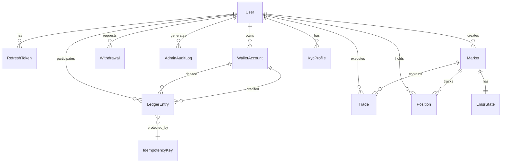

# Aussie Markets - Database Architecture Documentation

## Table of Contents

1. [Database Overview](#database-overview)
2. [Schema Design](#schema-design)
3. [Ledger System](#ledger-system)
4. [Data Models](#data-models)
5. [Database Constraints](#database-constraints)
6. [Performance Optimization](#performance-optimization)
7. [Migration Strategy](#migration-strategy)
8. [Testing](#testing)

## Database Overview

Aussie Markets uses **PostgreSQL 15+** as the primary database with **Prisma ORM** for type-safe database operations. The database architecture is designed around a **double-entry ledger system** to ensure financial accuracy and auditability.

### Key Design Principles

- **Financial Accuracy**: Double-entry bookkeeping ensures all transactions balance
- **Immutability**: Ledger entries cannot be modified or deleted once created
- **Idempotency**: Duplicate transactions are prevented via idempotency keys
- **Auditability**: Complete transaction history with metadata
- **Scalability**: Optimized indexes and efficient queries
- **Compliance**: Support for Australian financial regulations

### Technology Stack

- **Database**: PostgreSQL 15+ with advanced features
- **ORM**: Prisma Client with type generation
- **Migrations**: Prisma Migrate for schema management
- **Connection Pooling**: Built-in Prisma connection management
- **Monitoring**: Query logging and performance metrics

## Schema Design

### Entity Relationship Diagram



### Core Tables Overview

| Table | Purpose | Key Features |
|-------|---------|--------------|
| `users` | User accounts and authentication | Role-based access, email verification |
| `refresh_tokens` | Authentication token management | Automatic rotation, secure storage |
| `kyc_profiles` | Identity verification data | Australian compliance, document storage |
| `wallet_accounts` | Financial account management | Multi-currency support, balance tracking |
| `ledger_entries` | Double-entry transaction log | Immutable, balanced transactions |
| `idempotency_keys` | Duplicate prevention | Scoped keys with expiration |
| `markets` | Prediction market definitions | LMSR support, lifecycle management |
| `lmsr_state` | Market maker state | Automated pricing, liquidity tracking |
| `trades` | Individual trade records | Market participation, position tracking |
| `positions` | User market positions | Real-time P&L, share ownership |
| `withdrawals` | Payout management | KYC gated, audit trail |
| `admin_audit_log` | System change tracking | Compliance, security monitoring |

## Ledger System

### Double-Entry Bookkeeping

The ledger system implements traditional double-entry bookkeeping principles:

#### Core Principles

1. **Every transaction has at least two entries**
2. **Total debits must equal total credits** (sum = 0)
3. **Entries are immutable** once posted
4. **Complete audit trail** with metadata

#### Transaction Structure

```typescript
interface LedgerTransaction {
  transactionId: string;        // UUID grouping related entries
  entries: LedgerEntry[];      // Array of balanced entries
  timestamp: Date;             // Transaction timestamp
}

interface LedgerEntry {
  accountId: string;           // Debited/credited account
  counterAccountId: string;    // Related account for reference
  amountCents: bigint;         // Signed amount (+ credit, - debit)
  entryType: LedgerEntryType;  // DEPOSIT, TRADE, FEE, etc.
  description: string;         // Human-readable description
  metadata: Json;              // Additional context
}
```

#### Example: User Deposit Transaction

```sql
-- User deposits $100.00 via Stripe
-- Transaction ID: tx-123
-- Total sum: +10000 + (-10000) = 0 ✓

INSERT INTO ledger_entries VALUES
  ('entry-1', 'tx-123', 'user-cash-456', 'custody-cash-789', 'user-123', 10000, 'DEPOSIT', 'User deposit', '{"paymentId": "pi_stripe123"}'),
  ('entry-2', 'tx-123', 'custody-cash-789', 'user-cash-456', NULL, -10000, 'DEPOSIT', 'Custody debit for user deposit', '{"paymentId": "pi_stripe123"}');
```

### Account Types

#### User Accounts
- **`user_cash`**: User's available cash balance
- **`user_escrow`**: Funds held in pending trades

#### System Accounts
- **`custody_cash`**: Master custody account (all user deposits)
- **`fee_revenue`**: Platform fees and revenue
- **`liquidity_pool`**: Market maker liquidity reserves
- **`withdrawal_pending`**: Funds pending withdrawal processing

#### Account Balance Calculation

```sql
-- Real-time account balance
SELECT 
  account_id,
  SUM(amount_cents) as balance_cents
FROM ledger_entries 
WHERE account_id = $1 
GROUP BY account_id;

-- Optimized: Maintained in wallet_accounts table
SELECT available_cents + pending_cents as total_cents
FROM wallet_accounts 
WHERE id = $1;
```

### Idempotency System

#### Preventing Duplicate Transactions

```typescript
// Idempotency key structure
interface IdempotencyKey {
  key: string;                 // Unique identifier
  scope: string;               // 'ledger', 'payment', 'trade'
  response: Json;              // Cached response
  expiresAt: Date;            // Automatic cleanup
}
```

#### Usage Pattern

```typescript
async postTransaction(request: TransactionRequest): Promise<LedgerTransaction> {
  return this.prisma.$transaction(async (tx) => {
    // 1. Check idempotency key
    const existing = await tx.idempotencyKey.findUnique({
      where: { key: request.idempotencyKey }
    });
    
    if (existing?.response) {
      return existing.response; // Return cached result
    }
    
    // 2. Validate transaction balances
    this.validateTransactionEntries(request.entries);
    
    // 3. Create ledger entries
    // 4. Update account balances
    // 5. Store idempotency key with response
  });
}
```

### Transaction Validation

#### Balance Constraint

```sql
-- Database trigger ensuring transactions balance
CREATE OR REPLACE FUNCTION check_transaction_balance()
RETURNS TRIGGER AS $$
BEGIN
    IF (SELECT COALESCE(SUM(amount_cents), 0) 
        FROM ledger_entries 
        WHERE transaction_id = NEW.transaction_id) != 0 
    THEN
        RAISE EXCEPTION 'Transaction entries must sum to zero';
    END IF;
    RETURN NEW;
END;
$$ LANGUAGE plpgsql;

CREATE TRIGGER enforce_transaction_balance
    AFTER INSERT ON ledger_entries
    FOR EACH ROW
    EXECUTE FUNCTION check_transaction_balance();
```

#### Application-Level Validation

```typescript
private validateTransactionEntries(entries: LedgerEntryRequest[]): void {
  // Must have at least 2 entries
  if (entries.length < 2) {
    throw new BadRequestException('Double-entry transaction must have at least 2 entries');
  }

  // Must sum to zero
  const total = entries.reduce((sum, entry) => sum + entry.amountCents, BigInt(0));
  if (total !== BigInt(0)) {
    throw new BadRequestException(`Transaction entries must sum to zero. Current sum: ${total}`);
  }

  // Additional validation rules...
}
```

## Data Models

### User Management

#### User Entity

```typescript
model User {
  id                  String    @id @default(cuid())
  email               String    @unique
  passwordHash        String    // Argon2id hashed
  role                UserRole  @default(USER)
  emailVerified       Boolean   @default(false)
  emailVerifiedAt     DateTime?
  mfaEnabled          Boolean   @default(false)
  firstName           String?
  lastName            String?
  phoneNumber         String?
  isActive            Boolean   @default(true)
  lastLoginAt         DateTime?
  lastLoginIp         String?
  createdAt           DateTime  @default(now())
  updatedAt           DateTime  @updatedAt
}
```

#### Refresh Token Management

```typescript
model RefreshToken {
  id              String    @id @default(cuid())
  tokenHash       String    // Argon2id hashed opaque token
  userId          String
  expiresAt       DateTime
  revokedAt       DateTime?
  createdByIp     String
  createdAt       DateTime  @default(now())
}
```

### Financial Models

#### Wallet Account

```typescript
model WalletAccount {
  id              String        @id @default(cuid())
  userId          String?       // Null for system accounts
  accountType     String        // 'user_cash', 'custody_cash', etc.
  currency        String        @default("AUD")
  status          AccountStatus @default(ACTIVE)
  availableCents  BigInt        @default(0)
  pendingCents    BigInt        @default(0)
  createdAt       DateTime      @default(now())
  updatedAt       DateTime      @updatedAt
}
```

#### Ledger Entry

```typescript
model LedgerEntry {
  id                  String           @id @default(cuid())
  transactionId       String           // Groups related entries
  accountId           String
  counterAccountId    String
  userId              String?
  amountCents         BigInt           // Signed amount in cents
  currency            String           @default("AUD")
  entryType           LedgerEntryType
  description         String
  metadata            Json?
  timestamp           DateTime         @default(now())
}
```

### Market Models

#### Market Definition

```typescript
model Market {
  id                  String            @id @default(cuid())
  slug                String            @unique
  title               String
  description         String
  category            String
  outcomeType         MarketOutcomeType @default(BINARY)
  status              MarketStatus      @default(DRAFT)
  minTradeCents       BigInt            @default(100)
  maxTradeCents       BigInt?
  totalVolumeCents    BigInt            @default(0)
  liquidityPoolCents  BigInt            @default(0)
  openAt              DateTime?
  closeAt             DateTime?
  resolveAt           DateTime?
  resolvedAt          DateTime?
  resolutionOutcome   String?
  creatorId           String
  createdAt           DateTime          @default(now())
  updatedAt           DateTime          @updatedAt
}
```

#### LMSR State

```typescript
model LmsrState {
  id                String  @id @default(cuid())
  marketId          String  @unique
  liquidityParam    Decimal @db.Decimal(30, 18) // b parameter
  quantityYes       Decimal @db.Decimal(30, 18) // q_yes
  quantityNo        Decimal @db.Decimal(30, 18) // q_no
  lastPriceYes      Decimal @db.Decimal(10, 8)  // Calculated price
  lastPriceNo       Decimal @db.Decimal(10, 8)
  updatedAt         DateTime @updatedAt
}
```

### Compliance Models

#### KYC Profile

```typescript
model KycProfile {
  id              String    @id @default(cuid())
  userId          String    @unique
  status          KycStatus @default(PENDING)
  fullName        String
  dateOfBirth     DateTime  @db.Date
  address         String
  city            String
  state           String
  postcode        String
  country         String    // ISO country code
  documentType    String?
  documentNumber  String?
  documentUrl     String?   // Encrypted document storage
  selfieUrl       String?   // Liveness check photo
  providerRef     String?   // External KYC provider reference
  approvedAt      DateTime?
  rejectedAt      DateTime?
  submittedAt     DateTime?
  updatedAt       DateTime  @updatedAt
}
```

#### Admin Audit Log

```typescript
model AdminAuditLog {
  id          String      @id @default(cuid())
  userId      String
  action      AuditAction // CREATE, UPDATE, DELETE, etc.
  resource    String      // 'market', 'user', 'withdrawal'
  resourceId  String?
  oldValues   Json?       // Previous state
  newValues   Json?       // New state
  ipAddress   String
  userAgent   String?
  timestamp   DateTime    @default(now())
}
```

## Database Constraints

### Financial Integrity Constraints

#### Ledger Balance Constraint

```sql
-- Ensure transactions balance to zero
CREATE OR REPLACE FUNCTION check_transaction_balance()
RETURNS TRIGGER AS $$
BEGIN
    IF (SELECT COALESCE(SUM(amount_cents), 0) 
        FROM ledger_entries 
        WHERE transaction_id = NEW.transaction_id) != 0 
    THEN
        RAISE EXCEPTION 'Transaction entries must sum to zero. Transaction ID: %', NEW.transaction_id;
    END IF;
    RETURN NEW;
END;
$$ LANGUAGE plpgsql;
```

#### Immutability Constraints

```sql
-- Prevent modification of ledger entries
CREATE OR REPLACE FUNCTION prevent_ledger_modification()
RETURNS TRIGGER AS $$
BEGIN
    RAISE EXCEPTION 'Ledger entries are immutable and cannot be modified or deleted';
END;
$$ LANGUAGE plpgsql;

CREATE TRIGGER prevent_ledger_update
    BEFORE UPDATE ON ledger_entries
    FOR EACH ROW EXECUTE FUNCTION prevent_ledger_modification();

CREATE TRIGGER prevent_ledger_delete
    BEFORE DELETE ON ledger_entries
    FOR EACH ROW EXECUTE FUNCTION prevent_ledger_modification();
```

#### Account Balance Constraints

```sql
-- Ensure account balances don't go negative
ALTER TABLE wallet_accounts 
ADD CONSTRAINT chk_available_balance_non_negative 
CHECK (available_cents >= 0);

ALTER TABLE wallet_accounts 
ADD CONSTRAINT chk_pending_balance_non_negative 
CHECK (pending_cents >= 0);
```

### Data Quality Constraints

#### Unique Constraints

```sql
-- User email uniqueness
CREATE UNIQUE INDEX idx_users_email_lower ON users (LOWER(email));

-- Market slug uniqueness
CREATE UNIQUE INDEX idx_markets_slug ON markets (slug);

-- User-market position uniqueness
CREATE UNIQUE INDEX idx_positions_user_market ON positions (user_id, market_id);

-- Account type uniqueness per user
CREATE UNIQUE INDEX idx_wallet_accounts_user_type_currency 
ON wallet_accounts (user_id, account_type, currency);
```

#### Check Constraints

```sql
-- Email format validation
ALTER TABLE users ADD CONSTRAINT chk_email_format 
CHECK (email ~* '^[A-Za-z0-9._%+-]+@[A-Za-z0-9.-]+\.[A-Za-z]{2,}$');

-- Amount validation
ALTER TABLE ledger_entries ADD CONSTRAINT chk_amount_not_zero 
CHECK (amount_cents != 0);

-- Date validation
ALTER TABLE markets ADD CONSTRAINT chk_close_after_open 
CHECK (close_at > open_at OR close_at IS NULL);
```

## Performance Optimization

### Indexing Strategy

#### Core Performance Indexes

```sql
-- Ledger queries by account and time
CREATE INDEX idx_ledger_entries_account_timestamp 
ON ledger_entries (account_id, timestamp DESC);

-- Transaction lookup
CREATE INDEX idx_ledger_entries_transaction_id 
ON ledger_entries (transaction_id);

-- User ledger queries
CREATE INDEX idx_ledger_entries_user_timestamp 
ON ledger_entries (user_id, timestamp DESC) WHERE user_id IS NOT NULL;

-- Market queries
CREATE INDEX idx_markets_status_category ON markets (status, category);
CREATE INDEX idx_markets_close_at ON markets (close_at) WHERE close_at IS NOT NULL;

-- Trade queries
CREATE INDEX idx_trades_market_timestamp ON trades (market_id, timestamp DESC);
CREATE INDEX idx_trades_user_timestamp ON trades (user_id, timestamp DESC);
```

#### Partial Indexes

```sql
-- Active accounts only
CREATE INDEX idx_wallet_accounts_active_user 
ON wallet_accounts (user_id, account_type) WHERE status = 'ACTIVE';

-- Non-revoked refresh tokens
CREATE INDEX idx_refresh_tokens_active 
ON refresh_tokens (user_id, expires_at) WHERE revoked_at IS NULL;

-- Unexpired idempotency keys
CREATE INDEX idx_idempotency_keys_active 
ON idempotency_keys (key, scope) WHERE expires_at > NOW();
```

### Query Optimization

#### Efficient Balance Calculation

```sql
-- Optimized account balance query
WITH account_balance AS (
  SELECT 
    wa.id,
    wa.available_cents,
    wa.pending_cents,
    COALESCE(SUM(le.amount_cents), 0) as ledger_balance
  FROM wallet_accounts wa
  LEFT JOIN ledger_entries le ON le.account_id = wa.id
  WHERE wa.id = $1
  GROUP BY wa.id, wa.available_cents, wa.pending_cents
)
SELECT 
  id,
  available_cents,
  pending_cents,
  available_cents + pending_cents as total_cents,
  ledger_balance,
  (available_cents = ledger_balance) as balance_reconciled
FROM account_balance;
```

#### Efficient Position Queries

```sql
-- User positions with market data
SELECT 
  p.user_id,
  p.market_id,
  p.yes_shares,
  p.no_shares,
  p.total_invested_cents,
  m.title,
  m.status,
  m.close_at,
  ls.last_price_yes,
  ls.last_price_no
FROM positions p
JOIN markets m ON m.id = p.market_id
LEFT JOIN lmsr_state ls ON ls.market_id = m.id
WHERE p.user_id = $1
  AND (p.yes_shares > 0 OR p.no_shares > 0)
ORDER BY p.updated_at DESC;
```

### Connection Pooling

```typescript
// Prisma connection configuration
const prisma = new PrismaClient({
  datasources: {
    db: {
      url: process.env.DATABASE_URL,
    },
  },
  log: ['query', 'error', 'warn'],
});

// Connection pool optimization
// PostgreSQL default: max_connections = 100
// Recommended pool size: (core_count * 2) + effective_spindle_count
```

## Migration Strategy

### Schema Evolution

#### Migration Naming Convention

```
YYYYMMDD_HHMMSS_descriptive_name
20240115_143000_add_user_tables
20240115_150000_add_ledger_system
20240116_090000_add_market_tables
```

#### Safe Migration Practices

1. **Backward Compatible Changes First**
   - Add nullable columns
   - Create new indexes
   - Add new tables

2. **Data Migration in Separate Steps**
   - Populate new columns
   - Validate data integrity
   - Remove old columns

3. **Index Creation Strategy**
   - Create indexes concurrently
   - Monitor impact on performance
   - Drop unused indexes

#### Production Migration Process

```bash
# 1. Backup database
pg_dump -h $DB_HOST -U $DB_USER -d $DB_NAME > backup_$(date +%Y%m%d_%H%M%S).sql

# 2. Test migration on staging
prisma migrate deploy --preview-feature

# 3. Run migration during maintenance window
prisma migrate deploy

# 4. Verify migration success
prisma migrate status
```

### Data Seeding

#### Bootstrap Script

```typescript
// prisma/seed.ts
async function main() {
  // 1. Create admin user
  // 2. Create system accounts
  // 3. Create sample data (development only)
  // 4. Verify account balances
}
```

#### System Account Setup

```typescript
const systemAccounts = [
  { accountType: 'custody_cash', currency: 'AUD' },
  { accountType: 'fee_revenue', currency: 'AUD' },
  { accountType: 'liquidity_pool', currency: 'AUD' },
  { accountType: 'withdrawal_pending', currency: 'AUD' },
];

for (const account of systemAccounts) {
  await prisma.walletAccount.upsert({
    where: { 
      userId_accountType_currency: {
        userId: null,
        accountType: account.accountType,
        currency: account.currency,
      }
    },
    update: {},
    create: account,
  });
}
```

## Testing

### Unit Testing Strategy

#### Ledger Service Tests

```typescript
describe('LedgerService', () => {
  describe('Transaction Validation', () => {
    it('should reject unbalanced transactions', async () => {
      const unbalancedEntries = [
        { accountId: 'acc1', amountCents: BigInt(1000) },
        { accountId: 'acc2', amountCents: BigInt(-500) }, // Doesn't balance!
      ];
      
      await expect(
        ledgerService.postTransaction({ entries: unbalancedEntries, idempotencyKey: 'test' })
      ).rejects.toThrow('must sum to zero');
    });
    
    it('should accept balanced transactions', async () => {
      const balancedEntries = [
        { accountId: 'acc1', amountCents: BigInt(1000) },
        { accountId: 'acc2', amountCents: BigInt(-1000) },
      ];
      
      const result = await ledgerService.postTransaction({ 
        entries: balancedEntries, 
        idempotencyKey: 'test-balanced' 
      });
      
      expect(result).toBeDefined();
      expect(result.transactionId).toBeTruthy();
    });
  });
  
  describe('Idempotency', () => {
    it('should prevent duplicate transactions', async () => {
      const entries = [/* balanced entries */];
      const idempotencyKey = 'duplicate-test';
      
      // First call should succeed
      const firstResult = await ledgerService.postTransaction({ entries, idempotencyKey });
      
      // Second call should return cached result
      const secondResult = await ledgerService.postTransaction({ entries, idempotencyKey });
      
      expect(firstResult.transactionId).toBe(secondResult.transactionId);
    });
  });
});
```

#### Database Integration Tests

```typescript
describe('Database Constraints', () => {
  it('should enforce transaction balance at database level', async () => {
    await expect(async () => {
      await prisma.$transaction(async (tx) => {
        const txId = uuidv4();
        
        // Create unbalanced entries directly
        await tx.ledgerEntry.create({
          data: {
            transactionId: txId,
            accountId: 'acc1',
            counterAccountId: 'acc2',
            amountCents: BigInt(1000),
            entryType: 'DEPOSIT',
            description: 'Test entry 1',
          },
        });
        
        await tx.ledgerEntry.create({
          data: {
            transactionId: txId,
            accountId: 'acc2',
            counterAccountId: 'acc1',
            amountCents: BigInt(-500), // Unbalanced!
            entryType: 'DEPOSIT',
            description: 'Test entry 2',
          },
        });
      });
    }).rejects.toThrow();
  });
});
```

### Performance Testing

#### Load Testing Queries

```sql
-- Test concurrent balance updates
BEGIN;
SELECT available_cents FROM wallet_accounts WHERE id = $1 FOR UPDATE;
UPDATE wallet_accounts SET available_cents = available_cents + $2 WHERE id = $1;
COMMIT;

-- Test ledger query performance
EXPLAIN ANALYZE
SELECT * FROM ledger_entries 
WHERE account_id = $1 
ORDER BY timestamp DESC 
LIMIT 100;
```

### Data Integrity Verification

#### Balance Reconciliation

```typescript
async function verifyAccountBalances() {
  const accounts = await prisma.walletAccount.findMany();
  
  for (const account of accounts) {
    const ledgerBalance = await prisma.ledgerEntry.aggregate({
      where: { accountId: account.id },
      _sum: { amountCents: true },
    });
    
    const calculatedBalance = ledgerBalance._sum.amountCents || BigInt(0);
    const recordedBalance = account.availableCents;
    
    if (calculatedBalance !== recordedBalance) {
      throw new Error(`Balance mismatch for account ${account.id}`);
    }
  }
}
```

---

This database architecture provides a solid foundation for Aussie Markets' financial operations, ensuring accuracy, auditability, and compliance with Australian regulations while maintaining high performance and scalability.
