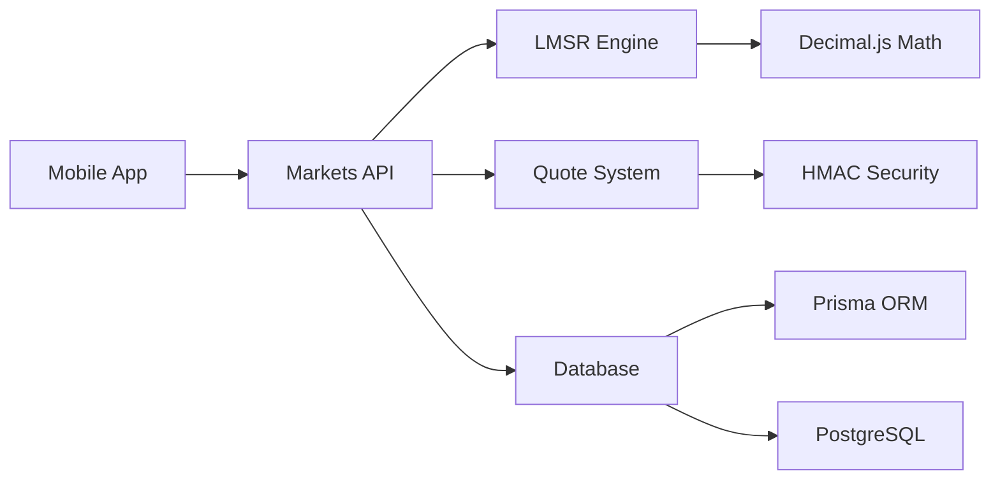

# Aussie Markets - Markets & LMSR Engine Documentation

## Table of Contents

1. [Markets System Overview](#markets-system-overview)
2. [LMSR Mathematical Engine](#lmsr-mathematical-engine)
3. [Market Management](#market-management)
4. [API Endpoints](#api-endpoints)
5. [Quote Generation & Security](#quote-generation--security)
6. [Mobile Implementation](#mobile-implementation)
7. [Testing & Validation](#testing--validation)
8. [Production Deployment](#production-deployment)

## Markets System Overview

Aussie Markets implements a sophisticated binary prediction market system powered by the Logarithmic Market Scoring Rule (LMSR). This system provides automated market making with mathematically guaranteed properties including monotonicity, no-arbitrage conditions, and bounded prices.

### Key Features

- **🎯 Binary Prediction Markets**: YES/NO outcome markets with clear resolution criteria
- **📊 LMSR Automated Market Maker**: Self-balancing liquidity with predictable pricing
- **🔐 Cryptographically Signed Quotes**: 10-second TTL quotes with HMAC verification
- **💰 Flexible Trading**: Amount-based or shares-based trading with real-time quotes
- **📱 Mobile-First Design**: Responsive UI optimized for mobile trading
- **🛡️ Enterprise Security**: Admin controls, role-based access, audit trails
- **🧮 Mathematical Precision**: 50-digit precision using decimal.js for financial accuracy

### Architecture Overview



## LMSR Mathematical Engine

### Core LMSR Formulas

The Logarithmic Market Scoring Rule (LMSR) is a market maker algorithm that provides automated liquidity for prediction markets. Our implementation uses the following core mathematical functions:

#### 1. Cost Function
```typescript
C(q_yes, q_no) = b × ln(exp(q_yes/b) + exp(q_no/b))
```

This function determines the total cost to reach a given state of outstanding shares.

#### 2. Price Function
```typescript
p_yes = exp(q_yes/b) / (exp(q_yes/b) + exp(q_no/b))
p_no = exp(q_no/b) / (exp(q_yes/b) + exp(q_no/b))
```

These functions calculate the instantaneous price for YES and NO outcomes.

#### 3. Buy Cost Calculation
```typescript
Cost_to_buy_Δ_shares = C(q_yes + Δ, q_no) - C(q_yes, q_no)  // For YES
Cost_to_buy_Δ_shares = C(q_yes, q_no + Δ) - C(q_yes, q_no)  // For NO
```

This calculates the cost to purchase a specific number of shares.

### Mathematical Properties

Our LMSR implementation guarantees the following mathematical properties:

#### 1. **Monotonicity**
- Buying more shares always costs more than buying fewer shares
- Price increases as more shares of an outcome are purchased
- Verified through comprehensive unit tests

#### 2. **Symmetry**
- When `q_yes = q_no`, both prices equal 50%
- Market treats both outcomes equally when quantities are equal
- Ensures fair initial conditions

#### 3. **Price Bounds [0, 1]**
- Prices are always between 0% and 100%
- Mathematical impossibility of negative or >100% prices
- Enforced through exponential function properties

#### 4. **No Arbitrage**
- Cost of buying both outcomes approximately equals maximum payout
- Prevents risk-free profit opportunities
- Maintains market integrity

#### 5. **Numerical Stability**
- Uses 50-digit precision arithmetic via decimal.js
- Handles extreme market conditions without overflow
- Maintains accuracy across all realistic trading scenarios

### LMSR Configuration Parameters

#### Liquidity Parameter (`b`)
The liquidity parameter controls market sensitivity:
- **Lower `b`**: Higher price sensitivity, more volatile
- **Higher `b`**: Lower price sensitivity, more stable
- **Range**: 1 to 10,000 (configurable)
- **Recommendation**: 50-200 for most markets

```typescript
// Example: Creating markets with different liquidity levels
const volatileMarket = lmsrService.initializeMarket(new Decimal(50));   // High sensitivity
const stableMarket = lmsrService.initializeMarket(new Decimal(200));    // Low sensitivity
```

#### Market Seeding
Markets can be seeded with initial bias:
```typescript
// Seed market with 70% YES probability
const biasedMarket = lmsrService.seedMarket(
  new Decimal(100),      // Liquidity parameter
  new Decimal(0.7)       // Initial YES price (70%)
);
```

## Market Management

### Market Lifecycle

1. **DRAFT** → Admin creates market
2. **OPEN** → Market seeded with liquidity
3. **CLOSED** → Market closed for trading
4. **RESOLVED** → Outcome determined

### Market Creation

```typescript
interface CreateMarketDto {
  slug: string;                 // URL-friendly identifier
  title: string;                // Market question
  description: string;          // Detailed description
  category: string;             // Market category
  liquidityParam: number;       // LMSR b parameter
  closeAt: Date;               // Trading close time
  resolveAt?: Date;            // Resolution deadline
  resolutionSourceUrl?: string; // Source for resolution
}
```

### Market Categories

- **Politics**: Elections, policy outcomes
- **Technology**: AI, blockchain, innovations
- **Sports**: Game outcomes, championships
- **Economics**: Market predictions, indicators
- **Science**: Research outcomes, discoveries
- **Entertainment**: Awards, box office
- **Crypto**: Price movements, adoption
- **Climate**: Weather, environmental events
- **Business**: Corporate events, mergers

### Market Seeding & Liquidity

Markets must be seeded with initial liquidity to become tradeable:

```typescript
interface SeedMarketDto {
  liquidityPoolCents: number;   // Initial liquidity (min $10)
  initialPriceYes?: number;     // Optional price bias (0.01-0.99)
}
```

**Liquidity Guidelines:**
- **Minimum**: $10 (1,000 cents)
- **Recommended**: $100-$1,000 for active markets
- **Maximum**: $100M (configurable)

## API Endpoints

### Public Endpoints

#### List Markets
```http
GET /markets?status=open&category=technology&search=AI&limit=20&cursor=abc123
```

**Response:**
```json
{
  "success": true,
  "data": {
    "markets": [
      {
        "id": "market_123",
        "slug": "ai-agi-2024",
        "title": "Will AI achieve AGI by 2024?",
        "description": "Market about artificial general intelligence...",
        "category": "Technology",
        "status": "OPEN",
        "prices": {
          "yes": 0.65,
          "no": 0.35,
          "yesPercent": 65,
          "noPercent": 35
        },
        "metrics": {
          "totalVolumeFormatted": "$2,450.00",
          "liquidityPoolFormatted": "$1,000.00"
        },
        "timeline": {
          "closeAt": "2024-12-31T23:59:59Z"
        }
      }
    ],
    "pagination": {
      "hasMore": true,
      "nextCursor": "market_456",
      "limit": 20
    }
  }
}
```

#### Get Market Details
```http
GET /markets/{id}
```

**Response includes:**
- Complete market information
- Current LMSR prices
- Trading limits and metrics
- Recent trades and statistics
- Creator information

#### Generate Trading Quote
```http
POST /markets/{id}/quote

{
  "outcome": "YES",
  "shares": 10,
  "type": "buy"
}
```

**Response:**
```json
{
  "success": true,
  "data": {
    "quote": {
      "marketId": "market_123",
      "outcome": "YES",
      "shares": 10,
      "type": "buy",
      "pricing": {
        "startPrice": 0.650,
        "endPrice": 0.675,
        "avgPrice": 0.663,
        "priceImpact": 0.025
      },
      "cost": {
        "costCents": 663,
        "costFormatted": "$6.63",
        "maxCostCents": 1000
      },
      "validation": {
        "timestamp": "2024-01-15T10:30:00Z",
        "ttl": 10,
        "expiresAt": "2024-01-15T10:30:10Z",
        "signature": "a1b2c3..."
      }
    }
  }
}
```

### Admin Endpoints

#### Create Market
```http
POST /admin/markets

{
  "slug": "new-market-2024",
  "title": "New Market Question?",
  "description": "Detailed market description...",
  "category": "Technology",
  "liquidityParam": 100,
  "closeAt": "2024-12-31T23:59:59Z"
}
```

#### Seed Market
```http
POST /admin/markets/{id}/seed

{
  "liquidityPoolCents": 100000,
  "initialPriceYes": 0.6
}
```

#### Resolve Market
```http
POST /admin/markets/{id}/resolve

{
  "outcome": "YES",
  "resolutionNotes": "Market resolved based on official announcement..."
}
```

## Quote Generation & Security

### Quote Security System

Quotes are protected against manipulation through cryptographic signatures:

#### HMAC Signature Generation
```typescript
const payload = JSON.stringify({
  marketId,
  outcome,
  shares,
  costCents,
  timestamp,
  ttl
});

const signature = crypto.createHmac('sha256', secret)
  .update(payload)
  .digest('hex');
```

#### Quote Validation
- **Signature Verification**: HMAC validation prevents tampering
- **TTL Enforcement**: 10-second expiry prevents stale quotes
- **Replay Protection**: Timestamps prevent quote reuse
- **Amount Validation**: Checks against market limits

### Quote Lifecycle

1. **Generation**: User requests quote for specific trade
2. **Signing**: Server generates HMAC signature with TTL
3. **Display**: Mobile app shows quote with countdown
4. **Validation**: Server verifies signature and expiry on trade
5. **Expiry**: Quote automatically expires after 10 seconds

### Quote Refresh Strategy

```typescript
// Mobile implementation
const generateQuote = async () => {
  const quote = await MarketsService.generateQuote(marketId, outcome, shares);
  
  // Set expiry timer
  setTimeout(() => {
    setQuote(null); // Clear expired quote
  }, quote.validation.ttl * 1000);
  
  return quote;
};
```

## Mobile Implementation

### Market List Screen

The market list provides comprehensive market discovery:

```typescript
// Key features:
- Real-time price updates
- Category filtering
- Search functionality
- Pull-to-refresh
- Infinite scrolling
- Loading states
- Error handling
```

#### Market Card Design
- **Header**: Category badge and status indicator
- **Content**: Title and description preview
- **Prices**: YES/NO percentages with color coding
- **Footer**: Volume and time remaining

### Market Detail Screen

Comprehensive market information and trading interface:

```typescript
// Components:
- Market description and timeline
- Current price display
- Trading panel with quote preview
- Amount/shares toggle
- Real-time quote updates
- Price impact visualization
```

#### Trading Flow
1. **Select Outcome**: YES or NO buttons
2. **Enter Amount**: Dollar amount or share count
3. **Generate Quote**: Real-time LMSR calculation
4. **Review Quote**: Price impact and costs
5. **Execute Trade**: (Future implementation)

### State Management

```typescript
// React Query for server state
const { data: markets } = useQuery({
  queryKey: ['markets', filters],
  queryFn: () => MarketsService.listMarkets(filters),
  staleTime: 30000,
  refetchInterval: 60000
});

// Local state for UI
const [selectedOutcome, setSelectedOutcome] = useState<'YES' | 'NO'>('YES');
const [tradeAmount, setTradeAmount] = useState('10.00');
const [useShares, setUseShares] = useState(false);
```

### Error Handling

Comprehensive error handling for all scenarios:
- **Network errors**: Retry mechanisms
- **Invalid quotes**: Clear error messages
- **Expired quotes**: Automatic refresh
- **Validation errors**: User-friendly feedback

## Testing & Validation

### Mathematical Property Tests

```typescript
describe('LMSR Mathematical Properties', () => {
  it('should maintain monotonicity', () => {
    // Buying more shares costs more
    const smallTrade = lmsrService.calculateBuyCost(state, 'YES', new Decimal(5));
    const largeTrade = lmsrService.calculateBuyCost(state, 'YES', new Decimal(10));
    expect(largeTrade.costCents).toBeGreaterThan(smallTrade.costCents);
  });

  it('should maintain symmetry', () => {
    // Equal quantities yield equal prices
    const symmetricState = { liquidityParam, quantityYes: 10, quantityNo: 10 };
    const prices = lmsrService.calculatePrices(symmetricState);
    expect(prices.priceYes).toBeCloseTo(0.5);
    expect(prices.priceNo).toBeCloseTo(0.5);
  });

  it('should maintain price bounds', () => {
    // Prices always between 0 and 1
    const extremeState = { liquidityParam, quantityYes: 1000, quantityNo: -500 };
    const prices = lmsrService.calculatePrices(extremeState);
    expect(prices.priceYes).toBeGreaterThan(0);
    expect(prices.priceYes).toBeLessThan(1);
  });
});
```

### Integration Tests

```typescript
describe('Market Trading Flow', () => {
  it('should complete full quote generation flow', async () => {
    // 1. Create and seed market
    const market = await marketsService.createMarket(marketDto, userId);
    await marketsService.seedMarket(market.id, seedDto);
    
    // 2. Generate quote
    const quote = await marketsService.generateQuote(market.id, 'YES', 10);
    
    // 3. Verify quote properties
    expect(quote.costCents).toBeGreaterThan(0);
    expect(quote.signature).toBeDefined();
    expect(quote.ttl).toBe(10);
    
    // 4. Verify quote validation
    const isValid = await marketsService.verifyQuoteSignature(quote);
    expect(isValid).toBe(true);
  });
});
```

### Performance Tests

- **LMSR Calculation Speed**: <1ms for standard trades
- **Quote Generation**: <50ms end-to-end
- **Market List Loading**: <500ms for 50 markets
- **Database Queries**: Optimized with proper indexing

### Load Testing

```bash
# Test market list endpoint
artillery quick --count 100 --num 10 http://localhost:3000/markets

# Test quote generation
artillery quick --count 50 --num 5 \
  --payload '{"outcome":"YES","shares":10}' \
  http://localhost:3000/markets/test-market/quote
```

## Production Deployment

### Environment Configuration

```bash
# Required environment variables
QUOTE_SIGNING_SECRET=production-secret-key-256-bit
DATABASE_URL=postgresql://user:pass@db:5432/aussie_markets
REDIS_URL=redis://redis:6379

# Market configuration
DEFAULT_LIQUIDITY_PARAM=100
MIN_MARKET_LIQUIDITY_CENTS=1000
MAX_MARKET_LIQUIDITY_CENTS=10000000
QUOTE_TTL_SECONDS=10
```

### Database Optimization

```sql
-- Market listing optimization
CREATE INDEX idx_markets_status_category ON markets(status, category);
CREATE INDEX idx_markets_created_at ON markets(created_at DESC);

-- LMSR state optimization
CREATE INDEX idx_lmsr_market_id ON lmsr_state(market_id);
CREATE INDEX idx_lmsr_updated_at ON lmsr_state(updated_at DESC);

-- Quote performance
CREATE INDEX idx_markets_slug ON markets(slug);
```

### Monitoring & Alerts

#### Key Metrics
- **Quote Generation Latency**: Target <50ms p95
- **LMSR Calculation Time**: Target <1ms p99
- **Market List Response**: Target <500ms p95
- **Database Query Performance**: Monitor slow queries

#### Health Checks
```typescript
// Market system health endpoint
GET /markets/health

{
  "status": "healthy",
  "timestamp": "2024-01-15T10:30:00Z",
  "services": {
    "lmsr": "operational",
    "database": "connected",
    "quotes": "generating"
  },
  "metrics": {
    "activeMarkets": 45,
    "quotesPerSecond": 12.5,
    "avgQuoteLatency": "23ms"
  }
}
```

### Scaling Considerations

#### Horizontal Scaling
- **Stateless API**: Full horizontal scaling support
- **Read Replicas**: Market listing from read-only DBs
- **CDN Caching**: Static market data caching
- **Load Balancing**: Multiple API instances

#### Performance Optimization
- **Quote Caching**: Redis cache for repeated quotes
- **Market Data**: Aggressive caching for popular markets
- **Database Pooling**: Connection pooling for high load
- **LMSR Optimization**: Pre-computed price tables for common scenarios

### Security Best Practices

#### Quote Security
- **Secure Secret Storage**: AWS SSM Parameter Store
- **Regular Secret Rotation**: Monthly secret updates
- **Rate Limiting**: Prevent quote spam attacks
- **Input Validation**: Comprehensive parameter validation

#### Market Integrity
- **Admin Audit Logs**: All admin actions logged
- **Market Resolution**: Multi-signature resolution process
- **Price Manipulation**: LMSR prevents manipulation
- **Access Controls**: Role-based permissions

### Disaster Recovery

#### Backup Strategy
- **Database Backups**: Hourly automated backups
- **Point-in-time Recovery**: 30-day retention
- **Cross-region Replication**: Geographic redundancy
- **Market State**: Critical LMSR state protection

#### Recovery Procedures
- **RTO**: 1 hour maximum downtime
- **RPO**: 5 minutes maximum data loss
- **Failover**: Automated failover to backup region
- **Data Integrity**: Verification of LMSR state consistency

---

The Aussie Markets system provides a robust, mathematically sound foundation for binary prediction markets with automated market making, ensuring fair pricing, liquidity, and security for all participants.
