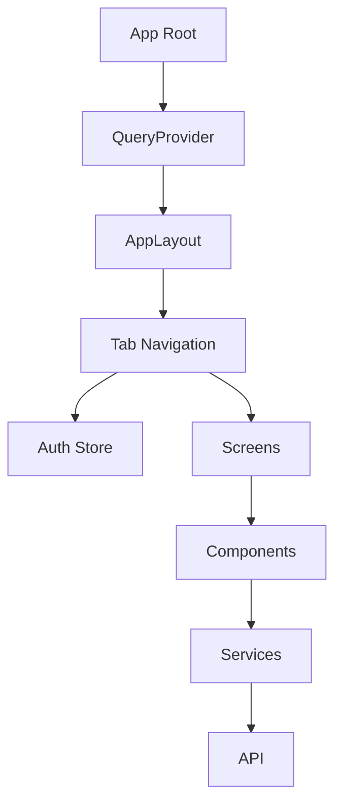
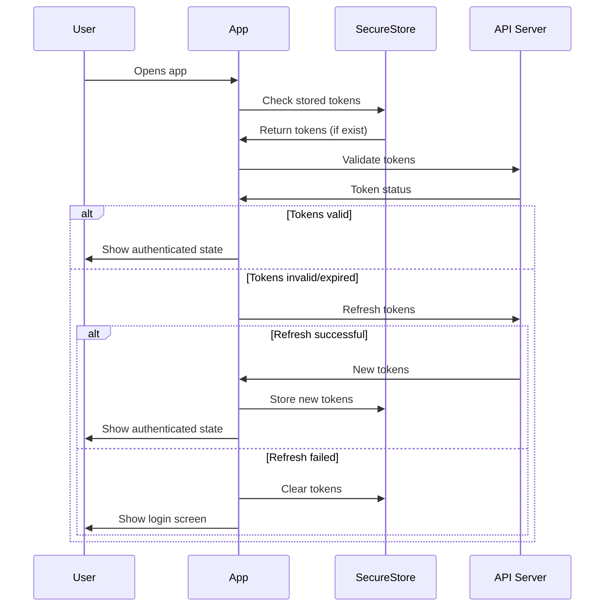

# Aussie Markets Mobile App Documentation

## Table of Contents

1. [Overview](#overview)
2. [Getting Started](#getting-started)
3. [Architecture](#architecture)
4. [Authentication](#authentication)
5. [State Management](#state-management)
6. [Navigation](#navigation)
7. [Security](#security)
8. [Components](#components)
9. [Services](#services)
10. [Testing](#testing)
11. [Development Guidelines](#development-guidelines)

## Overview

The Aussie Markets mobile app is built with React Native using Expo, providing a native iOS and Android experience for prediction market trading. The app implements secure authentication, real-time market updates, and seamless payment integration.

### Key Features

- **Secure Authentication**: Email/password with secure token storage
- **Real-time Markets**: Live market data and price updates
- **Secure Payments**: Apple Pay integration via Stripe
- **Native Performance**: Optimized for iOS and Android
- **Offline Support**: Graceful handling of network issues

### Technology Stack

- **Framework**: Expo SDK 53+ with React Native
- **Language**: TypeScript with strict configuration
- **State Management**: Zustand + React Query
- **Navigation**: Expo Router v5 with typed routes
- **Security**: expo-secure-store for sensitive data
- **UI**: Custom components with React Native

## Getting Started

### Prerequisites

- Node.js 20+
- Expo CLI
- iOS Simulator or Android Emulator
- Physical device for testing (recommended)

### Installation

```bash
# Install dependencies
cd apps/mobile
pnpm install

# Start development server
pnpm start

# Run on iOS simulator
pnpm run ios

# Run on Android emulator
pnpm run android

# Run on web (for development)
pnpm run web
```

### Configuration

#### app.json Configuration

```json
{
  "expo": {
    "name": "Aussie Markets",
    "slug": "aussie-markets",
    "version": "1.0.0",
    "platforms": ["ios", "android"],
    "icon": "./assets/icon.svg",
    "splash": {
      "image": "./assets/splash.svg",
      "resizeMode": "contain",
      "backgroundColor": "#007AFF"
    },
    "ios": {
      "supportsTablet": true,
      "bundleIdentifier": "com.jpcgroup.aussiemarkets",
      "config": {
        "usesNonExemptEncryption": false
      }
    },
    "android": {
      "package": "com.jpcgroup.aussiemarkets",
      "adaptiveIcon": {
        "foregroundImage": "./assets/adaptive-icon.svg",
        "backgroundColor": "#007AFF"
      }
    }
  }
}
```

#### Environment Variables

```typescript
// Constants configuration
const API_BASE_URL = Constants.expoConfig?.extra?.apiBaseUrl || 'http://localhost:3000/api/v1';
```

## Architecture

### Project Structure

```
apps/mobile/
├── app/                    # App screens (Expo Router)
│   ├── _layout.tsx        # Root layout with navigation
│   ├── index.tsx          # Home/Markets screen
│   ├── auth.tsx           # Login screen
│   ├── register.tsx       # Registration screen
│   ├── verify-email.tsx   # Email verification
│   ├── profile.tsx        # User profile
│   └── [id].tsx          # Dynamic market detail
├── components/            # Reusable UI components
│   ├── MarketCard.tsx
│   ├── WalletManager.tsx
│   └── NotificationCenter.tsx
├── contexts/              # React contexts and providers
│   ├── authStore.ts       # Zustand auth store
│   └── QueryProvider.tsx  # React Query provider
├── services/              # API services and utilities
│   ├── authService.ts     # Authentication API
│   ├── tradingService.ts  # Trading operations
│   └── notificationService.ts
├── types/                 # TypeScript type definitions
│   └── market.ts
└── data/                  # Mock data and constants
    └── mockData.ts
```

### Component Architecture



## Authentication

### Authentication Flow

The app implements a comprehensive authentication system with secure token management:



### Secure Token Storage

The app uses expo-secure-store for secure token persistence:

```typescript
import * as SecureStore from 'expo-secure-store';

const ACCESS_TOKEN_KEY = 'access_token';
const REFRESH_TOKEN_KEY = 'refresh_token';

// Store tokens securely in Keychain/Keystore
await SecureStore.setItemAsync(ACCESS_TOKEN_KEY, accessToken);
await SecureStore.setItemAsync(REFRESH_TOKEN_KEY, refreshToken);

// Retrieve tokens
const accessToken = await SecureStore.getItemAsync(ACCESS_TOKEN_KEY);
const refreshToken = await SecureStore.getItemAsync(REFRESH_TOKEN_KEY);

// Clear tokens on logout
await SecureStore.deleteItemAsync(ACCESS_TOKEN_KEY);
await SecureStore.deleteItemAsync(REFRESH_TOKEN_KEY);
```

### Auto Token Refresh

The app automatically refreshes tokens before they expire:

```typescript
class AuthService {
  private async getValidAccessToken(): Promise<string> {
    if (this.isTokenLikelyExpired(this.accessToken)) {
      return this.refreshAccessToken();
    }
    return this.accessToken;
  }

  private isTokenLikelyExpired(token: string): boolean {
    try {
      const payload = JSON.parse(atob(token.split('.')[1]));
      const expirationTime = payload.exp * 1000;
      const bufferTime = 2 * 60 * 1000; // 2 minutes buffer
      
      return Date.now() >= (expirationTime - bufferTime);
    } catch {
      return true; // Assume expired if can't parse
    }
  }
}
```

## State Management

### Zustand Auth Store

The app uses Zustand for lightweight, type-safe state management:

```typescript
interface AuthState {
  user: User | null;
  isAuthenticated: boolean;
  isLoading: boolean;
  isInitialized: boolean;
  
  // Actions
  initialize: () => Promise<void>;
  login: (data: LoginData) => Promise<void>;
  logout: () => Promise<void>;
  register: (data: RegisterData) => Promise<void>;
}

export const useAuthStore = create<AuthState>((set, get) => ({
  user: null,
  isAuthenticated: false,
  isLoading: false,
  isInitialized: false,

  initialize: async () => {
    set({ isLoading: true });
    
    try {
      const isAuthenticated = await authService.initialize();
      
      if (isAuthenticated) {
        const user = await authService.getProfile();
        set({ user, isAuthenticated: true, isInitialized: true });
      } else {
        set({ user: null, isAuthenticated: false, isInitialized: true });
      }
    } catch (error) {
      set({ user: null, isAuthenticated: false, isInitialized: true });
    } finally {
      set({ isLoading: false });
    }
  },

  login: async (data: LoginData) => {
    set({ isLoading: true });
    
    try {
      await authService.login(data);
      const user = await authService.getProfile();
      set({ user, isAuthenticated: true });
    } finally {
      set({ isLoading: false });
    }
  },
}));
```

### React Query Integration

React Query handles server state and API caching:

```typescript
export function QueryProvider({ children }: QueryProviderProps) {
  const queryClient = new QueryClient({
    defaultOptions: {
      queries: {
        staleTime: 1000 * 60 * 5, // 5 minutes
        gcTime: 1000 * 60 * 10,   // 10 minutes
        retry: (failureCount, error: any) => {
          // Don't retry on auth errors
          if (error?.status === 401 || error?.status === 403) {
            return false;
          }
          return failureCount < 3;
        },
      },
    },
  });

  return (
    <QueryClientProvider client={queryClient}>
      {children}
    </QueryClientProvider>
  );
}
```

## Navigation

### Expo Router Configuration

The app uses Expo Router for type-safe navigation:

```typescript
// app/_layout.tsx
export default function RootLayout() {
  return (
    <QueryProvider>
      <AppLayout />
    </QueryProvider>
  );
}

function AppLayout() {
  const { isAuthenticated } = useAuthStore();

  return (
    <Tabs screenOptions={{ /* tab config */ }}>
      <Tabs.Screen name="index" options={{ title: 'Markets' }} />
      <Tabs.Screen name="portfolio" options={{ title: 'Portfolio' }} />
      <Tabs.Screen name="profile" options={{
        title: isAuthenticated ? 'Profile' : 'Login'
      }} />
      
      {/* Hidden screens */}
      <Tabs.Screen name="auth" options={{ href: null }} />
      <Tabs.Screen name="register" options={{ href: null }} />
      <Tabs.Screen name="verify-email" options={{ href: null }} />
    </Tabs>
  );
}
```

### Navigation Patterns

```typescript
import { useRouter } from 'expo-router';

function LoginScreen() {
  const router = useRouter();

  const handleLogin = async () => {
    try {
      await login(credentials);
      router.replace('/'); // Navigate to home
    } catch (error) {
      // Handle error
    }
  };

  const navigateToRegister = () => {
    router.push('/register');
  };
}
```

## Security

### Security Best Practices

1. **Token Storage**: Only use expo-secure-store (Keychain/Keystore)
2. **No Plain Storage**: Never store sensitive data in AsyncStorage
3. **Automatic Cleanup**: Clear tokens on logout/errors
4. **Certificate Pinning**: Implemented for production builds
5. **Screen Protection**: Blur sensitive screens on app backgrounding

### Secure Storage Implementation

```typescript
// ✅ Correct: Use SecureStore
import * as SecureStore from 'expo-secure-store';

await SecureStore.setItemAsync('access_token', token);

// ❌ Incorrect: Never use AsyncStorage for tokens
import AsyncStorage from '@react-native-async-storage/async-storage';
await AsyncStorage.setItem('access_token', token); // DON'T DO THIS
```

### Network Security

```typescript
// TLS pinning for production
const response = await fetch(API_URL, {
  method: 'POST',
  headers: {
    'Authorization': `Bearer ${await authService.getValidAccessToken()}`,
    'Content-Type': 'application/json',
  },
  body: JSON.stringify(data),
});
```

## Components

### Authentication Screens

#### RegisterScreen

Comprehensive registration form with validation:

```typescript
export default function RegisterScreen() {
  const router = useRouter();
  const { register, isLoading } = useAuthStore();
  const [formData, setFormData] = useState({
    email: '',
    password: '',
    confirmPassword: '',
    firstName: '',
    lastName: '',
  });

  const validateForm = (): boolean => {
    // Comprehensive validation logic
    const errors = {};
    
    // Email validation
    if (!formData.email || !/\S+@\S+\.\S+/.test(formData.email)) {
      errors.email = 'Valid email required';
    }
    
    // Password validation
    if (!formData.password || formData.password.length < 8) {
      errors.password = 'Password must be 8+ characters';
    }
    
    return Object.keys(errors).length === 0;
  };
}
```

#### LoginScreen

Streamlined login with error handling:

```typescript
export default function AuthScreen() {
  const router = useRouter();
  const { login, isLoading } = useAuthStore();

  const handleLogin = async () => {
    try {
      await login(formData);
      router.replace('/');
    } catch (error) {
      if (error.message.includes('verify your email')) {
        Alert.alert('Email Not Verified', 'Please verify your email first', [
          { text: 'Cancel' },
          { text: 'Verify Now', onPress: () => router.push('/verify-email') }
        ]);
        return;
      }
      Alert.alert('Login Failed', error.message);
    }
  };
}
```

#### VerifyEmailScreen

Email verification with token input and deep linking:

```typescript
export default function VerifyEmailScreen() {
  const router = useRouter();
  const { token: urlToken } = useLocalSearchParams<{ token?: string }>();
  const { verifyEmail } = useAuthStore();

  // Auto-verify if token provided via deep link
  useEffect(() => {
    if (urlToken) {
      handleVerifyEmail(urlToken);
    }
  }, [urlToken]);

  const handleVerifyEmail = async (token: string) => {
    try {
      await verifyEmail(token);
      Alert.alert('Success', 'Email verified!', [
        { text: 'Continue', onPress: () => router.replace('/auth') }
      ]);
    } catch (error) {
      Alert.alert('Verification Failed', error.message);
    }
  };
}
```

### UI Components

#### Form Input Component

```typescript
interface InputProps {
  label: string;
  value: string;
  onChangeText: (text: string) => void;
  error?: string;
  secureTextEntry?: boolean;
  keyboardType?: KeyboardTypeOptions;
}

export function FormInput({ label, value, onChangeText, error, ...props }: InputProps) {
  return (
    <View style={styles.inputContainer}>
      <Text style={styles.label}>{label}</Text>
      <TextInput
        style={[styles.input, error && styles.inputError]}
        value={value}
        onChangeText={onChangeText}
        {...props}
      />
      {error && <Text style={styles.errorText}>{error}</Text>}
    </View>
  );
}
```

## Services

### AuthService

Main authentication service handling all auth operations:

```typescript
class AuthService {
  private accessToken: string | null = null;
  private refreshToken: string | null = null;
  private refreshPromise: Promise<string> | null = null;

  async initialize(): Promise<boolean> {
    try {
      const [storedAccessToken, storedRefreshToken] = await Promise.all([
        SecureStore.getItemAsync(ACCESS_TOKEN_KEY),
        SecureStore.getItemAsync(REFRESH_TOKEN_KEY),
      ]);

      if (storedAccessToken && storedRefreshToken) {
        this.accessToken = storedAccessToken;
        this.refreshToken = storedRefreshToken;
        
        // Verify token is still valid
        try {
          await this.getProfile();
          return true;
        } catch {
          // Try to refresh
          try {
            await this.refreshAccessToken();
            return true;
          } catch {
            await this.clearTokens();
            return false;
          }
        }
      }
      return false;
    } catch (error) {
      console.error('Auth initialization failed:', error);
      return false;
    }
  }

  async login(data: LoginData): Promise<AuthResponse> {
    const response = await fetch(`${API_BASE_URL}/auth/login`, {
      method: 'POST',
      headers: { 'Content-Type': 'application/json' },
      body: JSON.stringify(data),
    });

    if (!response.ok) {
      const error = await response.json();
      throw new Error(error.message || 'Login failed');
    }

    const result = await response.json();
    if (result.accessToken && result.refreshToken) {
      await this.storeTokens(result.accessToken, result.refreshToken);
    }

    return result;
  }
}
```

## Testing

### Unit Testing Setup

```bash
# Run tests
pnpm test

# Run tests with coverage
pnpm test -- --coverage

# Run tests in watch mode
pnpm test -- --watch
```

### Test Structure

```typescript
// __tests__/authService.test.ts
import { authService } from '../services/authService';

// Mock SecureStore
jest.mock('expo-secure-store', () => ({
  setItemAsync: jest.fn(),
  getItemAsync: jest.fn(),
  deleteItemAsync: jest.fn(),
}));

describe('AuthService', () => {
  beforeEach(() => {
    jest.clearAllMocks();
  });

  it('should initialize with stored tokens', async () => {
    // Mock stored tokens
    SecureStore.getItemAsync
      .mockResolvedValueOnce('access_token')
      .mockResolvedValueOnce('refresh_token');

    const result = await authService.initialize();
    expect(result).toBe(true);
  });
});
```

### Component Testing

```typescript
import { render, fireEvent, waitFor } from '@testing-library/react-native';
import LoginScreen from '../app/auth';

describe('LoginScreen', () => {
  it('should handle login submission', async () => {
    const { getByPlaceholderText, getByText } = render(<LoginScreen />);
    
    fireEvent.changeText(getByPlaceholderText('Email'), 'test@example.com');
    fireEvent.changeText(getByPlaceholderText('Password'), 'password123');
    fireEvent.press(getByText('Sign In'));

    await waitFor(() => {
      expect(mockLogin).toHaveBeenCalledWith({
        email: 'test@example.com',
        password: 'password123'
      });
    });
  });
});
```

## Development Guidelines

### Code Style

- Use TypeScript strict mode
- Follow React Native best practices
- Implement proper error boundaries
- Use consistent naming conventions
- Add comprehensive prop types

### Performance Optimization

```typescript
// Use React.memo for expensive components
export const ExpensiveComponent = React.memo(({ data }) => {
  return <ComplexUI data={data} />;
});

// Use useMemo for expensive calculations
const expensiveValue = useMemo(() => {
  return complexCalculation(data);
}, [data]);

// Use useCallback for event handlers
const handlePress = useCallback(() => {
  onPress(item.id);
}, [onPress, item.id]);
```

### Error Handling

```typescript
// Global error boundary
export class ErrorBoundary extends React.Component {
  constructor(props) {
    super(props);
    this.state = { hasError: false };
  }

  static getDerivedStateFromError(error) {
    return { hasError: true };
  }

  componentDidCatch(error, errorInfo) {
    console.error('Error caught by boundary:', error, errorInfo);
  }

  render() {
    if (this.state.hasError) {
      return <ErrorFallback />;
    }

    return this.props.children;
  }
}
```

### Accessibility

```typescript
// Implement proper accessibility
<TouchableOpacity
  accessible={true}
  accessibilityLabel="Sign in button"
  accessibilityHint="Tap to sign in to your account"
  accessibilityRole="button"
>
  <Text>Sign In</Text>
</TouchableOpacity>
```

### Building for Production

```bash
# Build for iOS
eas build --platform ios --profile production

# Build for Android
eas build --platform android --profile production

# Submit to app stores
eas submit --platform ios
eas submit --platform android
```

### EAS Configuration

```json
{
  "build": {
    "development": {
      "developmentClient": true,
      "distribution": "internal"
    },
    "preview": {
      "distribution": "internal"
    },
    "production": {
      "autoIncrement": true
    }
  },
  "submit": {
    "production": {
      "ios": {
        "appleId": "your-apple-id@example.com",
        "ascAppId": "your-app-store-connect-app-id"
      }
    }
  }
}
```

---

For more information, see the [Architecture Documentation](../architecture/README.md) and [API Documentation](../api/README.md).
