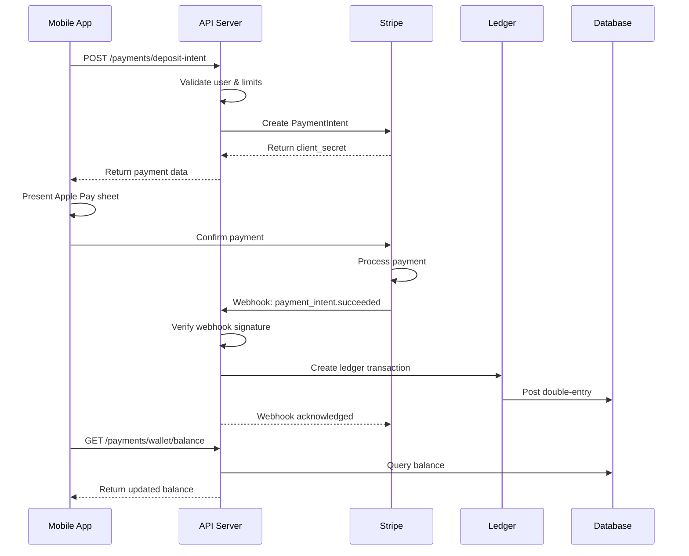

# Aussie Markets - Payment System Documentation

## Table of Contents

1. [Payment System Overview](#payment-system-overview)
2. [Apple Pay Integration](#apple-pay-integration)
3. [Stripe Configuration](#stripe-configuration)
4. [API Endpoints](#api-endpoints)
5. [Webhook Processing](#webhook-processing)
6. [Deposit Limits & Security](#deposit-limits--security)
7. [Mobile Implementation](#mobile-implementation)
8. [Testing Guide](#testing-guide)
9. [Production Setup](#production-setup)

## Payment System Overview

Aussie Markets implements a secure, compliant payment system for AUD deposits via Apple Pay using Stripe as the payment processor. The system is designed with bank-grade security, comprehensive fraud protection, and full integration with our double-entry ledger system.

### Key Features

- **🍎 Apple Pay Integration**: Native iOS payment experience with Touch ID/Face ID
- **💳 Stripe Processing**: Enterprise-grade payment processing with 99.99% uptime
- **🔒 Secure Webhooks**: Cryptographically signed webhook verification
- **⚖️ Ledger Integration**: Automatic double-entry bookkeeping for all transactions
- **🚧 Deposit Limits**: Configurable daily and velocity limits for fraud prevention
- **🔄 Idempotency**: Bulletproof duplicate transaction prevention
- **📊 Real-time Balance**: Instant balance updates via optimized database queries
- **🛡️ Fraud Protection**: Multi-layer security with Stripe Radar integration

### Architecture Diagram



## Apple Pay Integration

### iOS Configuration

#### 1. Apple Developer Account Setup

```bash
# Required capabilities:
- Apple Pay Payment Processing
- In-App Payments (com.apple.developer.in-app-payments)

# Merchant ID configuration:
- Identifier: merchant.com.jpcgroup.aussiemarkets
- Description: Aussie Markets Payment Processing
- Domain verification required for web integration
```

#### 2. App Configuration

```json
// apps/mobile/app.json
{
  "expo": {
    "ios": {
      "bundleIdentifier": "com.jpcgroup.aussiemarkets",
      "entitlements": {
        "com.apple.developer.in-app-payments": ["merchant.com.jpcgroup.aussiemarkets"]
      },
      "merchantId": "merchant.com.jpcgroup.aussiemarkets"
    },
    "plugins": [
      "@stripe/stripe-react-native"
    ]
  }
}
```

#### 3. Certificate Management

```bash
# Generate merchant identity certificate
# 1. Create Certificate Signing Request (CSR)
# 2. Upload to Apple Developer Portal
# 3. Download merchant certificate
# 4. Upload to Stripe Dashboard

# Payment processing certificate (for domain verification)
# 1. Generate in Stripe Dashboard
# 2. Upload to Apple Developer Portal
```

### Mobile Implementation

#### Stripe Provider Setup

```typescript
// apps/mobile/app/wallet.tsx
import { StripeProvider } from '@stripe/stripe-react-native';

const publishableKey = process.env.EXPO_PUBLIC_STRIPE_PUBLISHABLE_KEY;

<StripeProvider 
  publishableKey={publishableKey} 
  merchantIdentifier="merchant.com.jpcgroup.aussiemarkets"
>
  <WalletContent />
</StripeProvider>
```

#### Apple Pay Payment Flow

```typescript
const { initPaymentSheet, presentPaymentSheet } = useStripe();

// 1. Create deposit intent
const depositIntent = await PaymentService.createDepositIntent(amountCents);

// 2. Initialize payment sheet
const { error: initError } = await initPaymentSheet({
  merchantDisplayName: 'Aussie Markets',
  paymentIntentClientSecret: depositIntent.data.clientSecret,
  applePay: {
    merchantIdentifier: 'merchant.com.jpcgroup.aussiemarkets',
    countryCode: 'AU',
    currencyCode: 'AUD',
    cartItems: [{
      label: 'Deposit to Wallet',
      amount: (amountCents / 100).toFixed(2),
      paymentType: 'Immediate',
    }],
  },
});

// 3. Present payment sheet
const { error: paymentError } = await presentPaymentSheet();

// 4. Handle success/error
if (!paymentError) {
  // Payment successful - webhook will update balance
  Alert.alert('Payment Successful!', 'Your deposit will appear shortly.');
}
```

## Stripe Configuration

### Account Setup

#### 1. Stripe Account Configuration

```bash
# Account settings:
- Business type: Technology/Software
- Country: Australia
- Currency: AUD (primary)
- Business verification: Required for live payments

# Apple Pay setup:
- Domain verification: Required for web integration
- Merchant identity verification: Upload Apple certificates
- Test with Apple Pay test cards
```

#### 2. Webhook Configuration

```bash
# Webhook endpoint: https://api.aussie-markets.com/payments/webhooks/stripe
# Events to subscribe to:
- payment_intent.succeeded
- payment_intent.payment_failed
- payment_intent.canceled
- charge.dispute.created
- payment_method.attached

# Webhook signing secret: Store in AWS SSM Parameter Store
```

#### 3. Environment Configuration

```bash
# Development (.env.local)
STRIPE_PUBLISHABLE_KEY=pk_test_...
STRIPE_SECRET_KEY=sk_test_...
STRIPE_WEBHOOK_SECRET=whsec_...

# Production (AWS SSM Parameter Store)
/aussie-markets/prod/api/STRIPE_PUBLISHABLE_KEY
/aussie-markets/prod/api/STRIPE_SECRET_KEY
/aussie-markets/prod/api/STRIPE_WEBHOOK_SECRET
/aussie-markets/prod/api/APPLE_MERCHANT_ID
```

### Payment Intent Configuration

```typescript
// Optimized for Apple Pay and Australian market
const paymentIntent = await stripe.paymentIntents.create({
  amount: amountCents,
  currency: 'aud',
  automatic_payment_methods: {
    enabled: true,
    allow_redirects: 'never', // Mobile app context
  },
  payment_method_types: ['card'],
  metadata: {
    userId,
    userEmail,
    type: 'deposit',
    platform: 'aussie-markets',
  },
  confirmation_method: 'automatic',
  capture_method: 'automatic',
});
```

## API Endpoints

### 1. Create Deposit Intent

**Endpoint**: `POST /payments/deposit-intent`

**Authentication**: Required (JWT Bearer token)

**Request Body**:
```json
{
  "amountCents": 10000,
  "currency": "AUD",
  "description": "Wallet deposit"
}
```

**Response**:
```json
{
  "success": true,
  "data": {
    "clientSecret": "pi_..._secret_...",
    "paymentIntentId": "pi_1234567890",
    "amountCents": 10000,
    "currency": "AUD",
    "publishableKey": "pk_test_..."
  }
}
```

**Error Responses**:
```json
// Deposit limit exceeded
{
  "success": false,
  "error": "Deposit exceeds daily limit. Remaining: $500.00 AUD"
}

// Unverified email
{
  "success": false,
  "error": "Email must be verified before making deposits"
}
```

### 2. Get Wallet Balance

**Endpoint**: `GET /payments/wallet/balance?currency=AUD`

**Authentication**: Required

**Response**:
```json
{
  "success": true,
  "data": {
    "availableCents": "150000",
    "pendingCents": "0",
    "totalCents": "150000",
    "currency": "AUD",
    "availableFormatted": "$1,500.00",
    "totalFormatted": "$1,500.00"
  }
}
```

### 3. Get Deposit Limits

**Endpoint**: `GET /payments/deposit-limits`

**Authentication**: Required

**Response**:
```json
{
  "success": true,
  "data": {
    "dailyLimitCents": 1000000,
    "dailyUsedCents": 50000,
    "dailyRemainingCents": 950000,
    "velocityLimitCents": 500000,
    "velocityUsedCents": 50000,
    "velocityRemainingCents": 450000,
    "isAtLimit": false
  }
}
```

### 4. Get Transaction History

**Endpoint**: `GET /payments/wallet/transactions?limit=20&cursor=xyz`

**Authentication**: Required

**Response**:
```json
{
  "success": true,
  "data": {
    "entries": [
      {
        "id": "entry_123",
        "transactionId": "tx_456",
        "amountCents": "10000",
        "amountFormatted": "+$100.00",
        "entryType": "DEPOSIT",
        "description": "Deposit via Stripe (card)",
        "timestamp": "2024-01-15T10:30:00Z",
        "metadata": {
          "paymentIntentId": "pi_123",
          "chargeId": "ch_456"
        }
      }
    ],
    "hasMore": true,
    "nextCursor": "entry_789"
  }
}
```

### 5. Stripe Webhook

**Endpoint**: `POST /payments/webhooks/stripe`

**Authentication**: Stripe signature verification

**Headers**:
```
stripe-signature: t=...,v1=...,v0=...
```

**Processing Flow**:
1. Verify webhook signature using `STRIPE_WEBHOOK_SECRET`
2. Check for duplicate processing via `idempotency_keys` table
3. Process event based on type (`payment_intent.succeeded`, etc.)
4. Create ledger transaction for successful payments
5. Update wallet balances
6. Return acknowledgment to Stripe

## Webhook Processing

### Security Verification

```typescript
// Signature verification prevents webhook spoofing
const event = stripe.webhooks.constructEvent(
  payload,
  signature,
  endpointSecret
);
```

### Event Processing

#### `payment_intent.succeeded`

```typescript
async handlePaymentIntentSucceeded(event: Stripe.Event) {
  const paymentIntent = event.data.object as Stripe.PaymentIntent;
  
  // Extract metadata
  const { userId, amountCents, currency } = extractPaymentMetadata(paymentIntent);
  
  // Create double-entry ledger transaction
  const transaction = await ledgerService.postTransaction({
    entries: [
      {
        accountId: userCashAccountId,
        counterAccountId: custodyCashAccountId,
        userId,
        amountCents: BigInt(amountCents),
        entryType: LedgerEntryType.DEPOSIT,
        description: `Deposit via Stripe`,
        metadata: {
          paymentIntentId: paymentIntent.id,
          chargeId: charge?.id,
          stripeEventId: event.id,
        },
      },
      {
        accountId: custodyCashAccountId,
        counterAccountId: userCashAccountId,
        amountCents: BigInt(-amountCents),
        entryType: LedgerEntryType.DEPOSIT,
        description: `Custody credit for user deposit`,
        metadata: { /* ... */ },
      },
    ],
    idempotencyKey: `stripe_${event.id}`,
  });
  
  return { processed: true, transactionId: transaction.transactionId };
}
```

#### Idempotency Protection

```typescript
// Prevent duplicate webhook processing
const isDuplicate = await checkEventProcessed(event.id);
if (isDuplicate) {
  return { processed: true, result: 'duplicate_event_skipped' };
}

// Store processing record
await storeEventRecord(event.id, event.type, 'processed', result);
```

## Deposit Limits & Security

### Configurable Limits

```typescript
// Environment configuration
const dailyLimitCents = parseInt(process.env.DEPOSIT_DAILY_LIMIT_CENTS || '1000000'); // $10,000
const velocityLimitCents = parseInt(process.env.DEPOSIT_VELOCITY_LIMIT_CENTS || '500000'); // $5,000
const velocityWindowHours = parseInt(process.env.DEPOSIT_VELOCITY_WINDOW_HOURS || '1'); // 1 hour
```

### Limit Validation

```typescript
async validateDepositLimits(userId: string, amountCents: number) {
  const limits = await getDepositLimits(userId);
  
  if (amountCents > limits.dailyRemainingCents) {
    throw new ForbiddenException(
      `Deposit exceeds daily limit. Remaining: $${limits.dailyRemainingCents/100} AUD`
    );
  }
  
  if (amountCents > limits.velocityRemainingCents) {
    throw new ForbiddenException(
      `Deposit exceeds velocity limit. Remaining: $${limits.velocityRemainingCents/100} AUD`
    );
  }
}
```

### Security Features

#### 1. Multi-Layer Validation
- **Client-side**: Basic amount validation and limit checking
- **API-side**: Comprehensive validation with database constraints
- **Stripe-side**: Fraud detection and risk scoring
- **Database-side**: Transaction integrity and balance constraints

#### 2. Fraud Prevention
```typescript
// Stripe Radar integration (automatic)
- Machine learning fraud detection
- Velocity checking
- Geographic risk assessment
- Device fingerprinting

// Custom rules
- Daily deposit limits per user
- Velocity limits (amount per time window)
- Email verification requirements
- Account status checks
```

#### 3. Monitoring & Alerts
```typescript
// Key metrics to monitor:
- Failed payment attempts per user
- Velocity limit violations
- Webhook processing failures
- Balance reconciliation discrepancies
- Chargeback notifications
```

## Mobile Implementation

### Payment Service Integration

```typescript
// apps/mobile/services/paymentService.ts
class PaymentServiceClass {
  async processApplePayPayment(amountCents: number): Promise<ApplePayResult> {
    try {
      // 1. Create deposit intent
      const depositIntent = await this.createDepositIntent(amountCents);
      
      // 2. Initialize payment sheet (handled in component)
      // 3. Present Apple Pay sheet (handled in component)
      // 4. Return success/error
      
      return { success: true, paymentIntentId: depositIntent.data.paymentIntentId };
    } catch (error) {
      return { success: false, error: error.message };
    }
  }
}
```

### Wallet UI Components

#### Balance Display
```typescript
// Real-time balance with automatic refresh
const { data: balanceData, isLoading } = useQuery({
  queryKey: ['wallet', 'balance'],
  queryFn: () => PaymentService.getWalletBalance(),
  refetchInterval: 30000, // 30 seconds
});
```

#### Apple Pay Button
```typescript
<TouchableOpacity
  style={styles.applePayButton}
  onPress={handleDeposit}
  disabled={!isApplePaySupported || depositMutation.isPending}
>
  <Ionicons name="logo-apple" size={24} color="white" />
  <Text style={styles.applePayButtonText}>
    Pay ${(depositAmount / 100).toFixed(2)}
  </Text>
</TouchableOpacity>
```

#### Transaction History
```typescript
// Paginated transaction list with pull-to-refresh
const { data: historyData } = useQuery({
  queryKey: ['wallet', 'transactions'],
  queryFn: () => PaymentService.getTransactionHistory({ limit: 10 }),
});
```

### Error Handling

```typescript
export const handlePaymentError = (error: any) => {
  let userMessage = 'Payment failed. Please try again.';
  
  if (error.message.includes('limit')) {
    userMessage = 'Deposit limit exceeded. Please try a smaller amount.';
  } else if (error.message.includes('declined')) {
    userMessage = 'Payment was declined. Please check your payment method.';
  } else if (error.message.includes('verify')) {
    userMessage = 'Please verify your email before making deposits.';
  }
  
  Alert.alert('Payment Error', userMessage);
};
```

## Testing Guide

### 1. Stripe Test Cards

```javascript
// Apple Pay test cards (use in iOS Simulator)
const testCards = {
  visa: '4242424242424242',
  visaDebit: '4000056655665556',
  mastercard: '5555555555554444',
  amex: '378282246310005',
  declined: '4000000000000002',
  insufficientFunds: '4000000000009995',
  invalidCvc: '4000000000000127',
};
```

### 2. Test Scenarios

#### Successful Payment Flow
```bash
# 1. Create deposit intent
curl -X POST /payments/deposit-intent \
  -H "Authorization: Bearer $JWT_TOKEN" \
  -d '{"amountCents": 10000}'

# 2. Use client_secret in Apple Pay sheet
# 3. Confirm payment in iOS Simulator
# 4. Verify webhook processing
# 5. Check balance update
```

#### Limit Testing
```bash
# Test daily limit (should fail after reaching limit)
for i in {1..11}; do
  curl -X POST /payments/deposit-intent \
    -H "Authorization: Bearer $JWT_TOKEN" \
    -d '{"amountCents": 100000}' # $1,000 x 11 = $11,000 (exceeds $10,000 limit)
done
```

#### Webhook Testing
```bash
# Use Stripe CLI to forward webhooks
stripe listen --forward-to localhost:3000/payments/webhooks/stripe

# Trigger test webhook
stripe trigger payment_intent.succeeded
```

### 3. Demo Script

```bash
# Run comprehensive payment system demo
cd apps/api
npm run test:demo:payments

# Output includes:
# - Deposit intent creation
# - Webhook processing simulation
# - Ledger verification
# - Balance checking
# - Limit enforcement
# - Idempotency testing
```

### 4. Integration Testing

```typescript
describe('Payment Integration', () => {
  it('should complete full payment flow', async () => {
    // 1. Create deposit intent
    const intent = await paymentService.createDepositIntent(userId, 10000);
    
    // 2. Simulate successful payment
    const webhook = mockSuccessfulWebhook(intent.paymentIntentId);
    const result = await webhookService.processStripeWebhook(webhook);
    
    // 3. Verify ledger entries
    const transaction = await ledgerService.getTransaction(result.transactionId);
    expect(transaction.entries).toHaveLength(2);
    
    // 4. Verify balance update
    const balance = await paymentService.getWalletBalance(userId);
    expect(balance.data.availableCents).toBe('10000');
  });
});
```

## Production Setup

### 1. Stripe Configuration

#### Live Account Setup
```bash
# Complete business verification
- Business documents
- Bank account verification
- Identity verification

# Configure webhooks
- Production endpoint: https://api.aussie-markets.com/payments/webhooks/stripe
- Enable relevant events
- Configure signing secret

# Set up Apple Pay
- Upload production merchant certificates
- Verify domain ownership
- Test with real Apple Pay
```

#### Security Configuration
```bash
# Stripe Radar (fraud prevention)
- Enable machine learning models
- Configure custom rules
- Set up risk thresholds
- Monitor false positives

# Webhook security
- Use HTTPS only
- Verify signatures
- Implement idempotency
- Monitor processing times
```

### 2. AWS Infrastructure

#### Parameter Store Configuration
```bash
# Store sensitive values in AWS SSM
aws ssm put-parameter \
  --name "/aussie-markets/prod/api/STRIPE_SECRET_KEY" \
  --value "sk_live_..." \
  --type "SecureString"

aws ssm put-parameter \
  --name "/aussie-markets/prod/api/STRIPE_WEBHOOK_SECRET" \
  --value "whsec_..." \
  --type "SecureString"
```

#### Load Balancer Configuration
```yaml
# ALB with proper SSL termination
apiVersion: v1
kind: Service
metadata:
  name: aussie-markets-api
  annotations:
    service.beta.kubernetes.io/aws-load-balancer-ssl-cert: "arn:aws:acm:..."
    service.beta.kubernetes.io/aws-load-balancer-backend-protocol: "http"
```

### 3. Monitoring & Alerting

#### Key Metrics
```typescript
// CloudWatch metrics to track:
- Payment success rate
- Webhook processing latency
- Failed payment attempts
- Deposit limit violations
- Balance reconciliation errors
```

#### Alerts Configuration
```yaml
# PagerDuty/SNS alerts for:
- Webhook processing failures > 5%
- Payment success rate < 95%
- Balance reconciliation discrepancies
- High velocity limit violations
- Stripe API errors > threshold
```

### 4. Compliance & Auditing

#### PCI Compliance
```bash
# SAQ-A eligibility requirements:
- No card data storage
- Use Stripe SDK only
- HTTPS everywhere
- Quarterly vulnerability scans
- Annual compliance review
```

#### Financial Auditing
```sql
-- Daily reconciliation query
SELECT 
  DATE(timestamp) as date,
  SUM(CASE WHEN amount_cents > 0 THEN amount_cents ELSE 0 END) as total_deposits,
  COUNT(CASE WHEN amount_cents > 0 THEN 1 END) as deposit_count
FROM ledger_entries 
WHERE entry_type = 'DEPOSIT' 
  AND timestamp >= CURRENT_DATE - INTERVAL '30 days'
GROUP BY DATE(timestamp)
ORDER BY date DESC;
```

### 5. Backup & Recovery

#### Database Backups
```bash
# Automated daily backups
- RDS automated backups (7 days retention)
- Cross-region backup replication
- Point-in-time recovery capability
- Monthly backup verification
```

#### Disaster Recovery
```bash
# Multi-AZ deployment
- Primary: ap-southeast-2a
- Secondary: ap-southeast-2b
- RTO: < 1 hour
- RPO: < 15 minutes
```

---

This payment system provides enterprise-grade security and reliability for processing AUD deposits via Apple Pay, with comprehensive fraud protection, audit trails, and compliance features ready for the Australian market.
